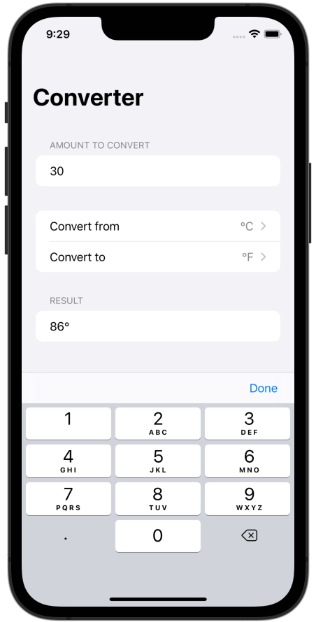

# Challenge 1 - Temperature Converter

## Topics

MeasurementFormatter, Form, NavigationView, @State, Picker

## The project

Build an app that handles unit conversions: users will select an input unit and an output unit, then enter a value, and see the output of the conversion.

## Screenshots

