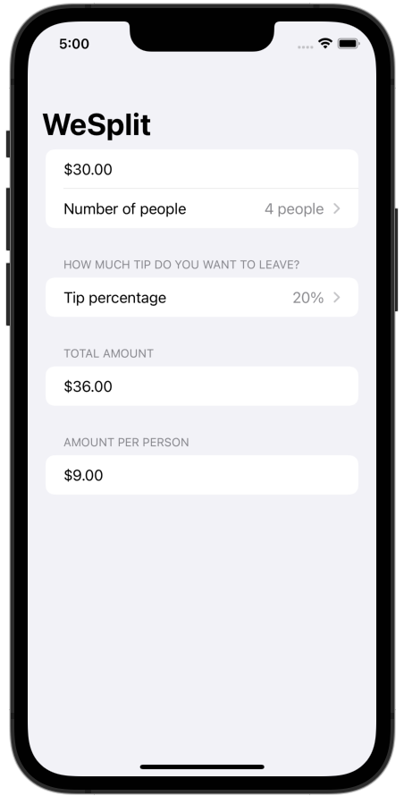

# Project 1 - WeSplit

A check-sharing app that calculates how to split a check based on the number of people and how much tip you want to leave.

## Topics

Form, NavigationView, @State, Picker

## Challenges

1. Add a header to the third section, saying “Amount per person”
2. Add another section showing the total amount for the check – i.e., the original amount plus tip value, without dividing by the number of people.
3. Change the tip percentage picker to show a new screen rather than using a segmented control, and give it a wider range of options – everything from 0% to 100%.

## Screenshots

