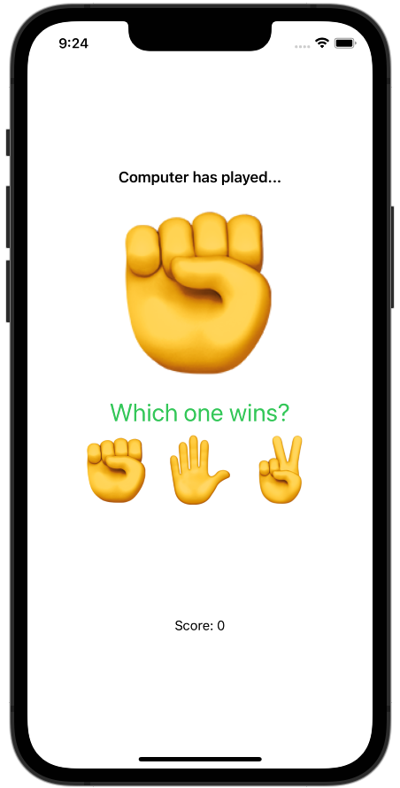

# Rock, Paper, Scissors

A brain game based on Rock, Paper, Scissors.

## Topics

@State, VStack, HStack, Spacer.

## Challenges

- Each turn of the game the app will randomly pick either rock, paper, or scissors.
- Each turn the app will alternate between prompting the player to win or lose.
- The player must then tap the correct move to win or lose the game.
- If they are correct they score a point; otherwise they lose a point.
- The game ends after 10 questions, at which point their score is shown.

So, if the app chose “Rock” and “Win” the player would need to choose “Paper”, but if the app chose “Rock” and “Lose” the player would need to choose “Scissors”.

## Screenshots

