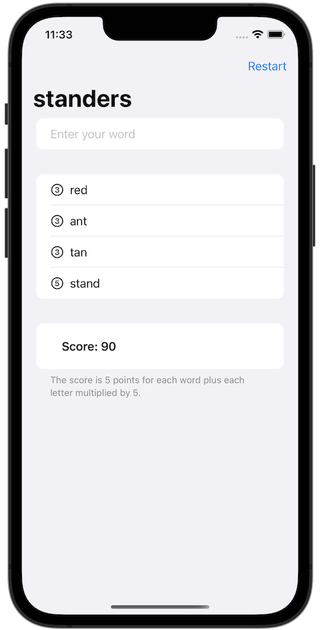

#  WordScramble

The game will show players a random eight-letter word, and ask them to make words out of it.

## Topics

List, onAppear(), Bundle, fatalError(), UITextChecker.

## Challenges

1. Disallow answers that are shorter than three letters or are just our start word.
2. Add a toolbar button that calls startGame(), so users can restart with a new word whenever they want to.
3. Put a text view somewhere so you can track and show the player’s score for a given root word. How you calculate score is down to you, but something involving number of words and their letter count would be reasonable.

## Screenshots

