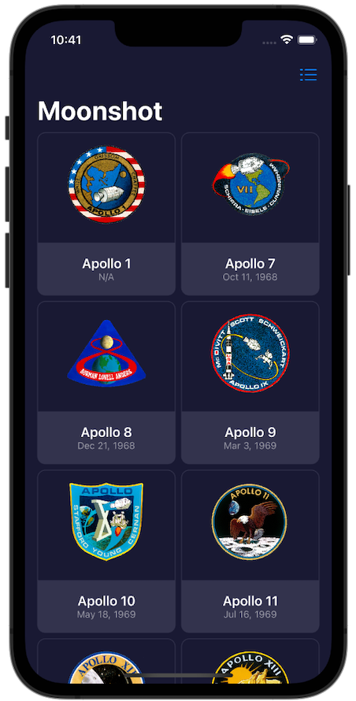
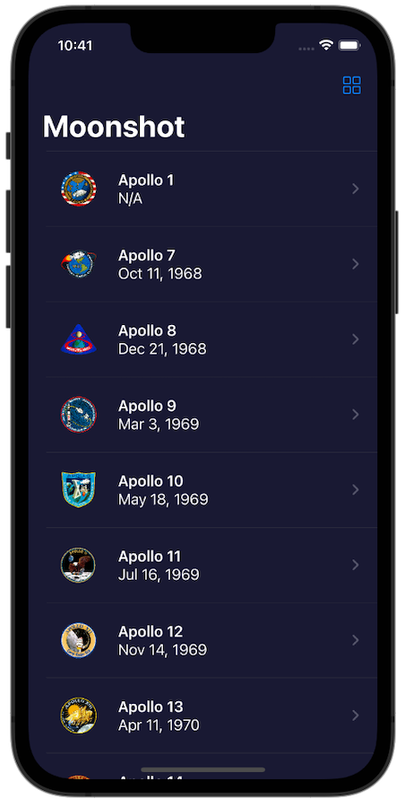
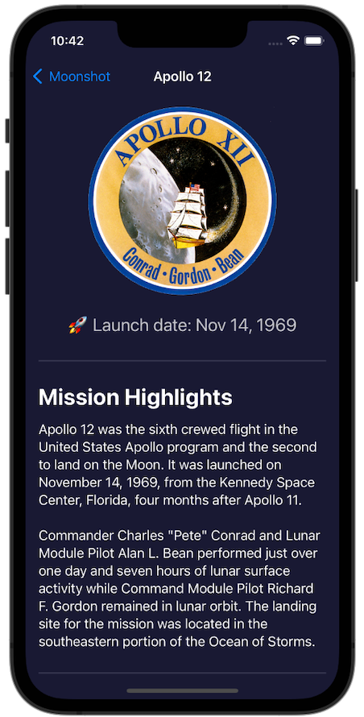
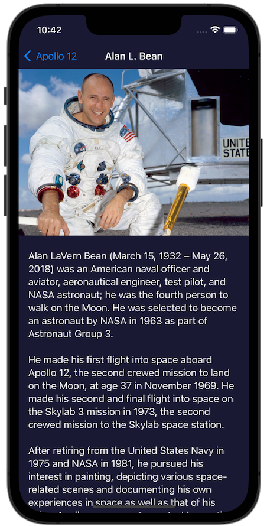

# Moonshot

An app that lets users learn about the missions and astronauts that formed NASA’s Apollo space program.

## Topics

Codable, GeometryReader, ScrollView, NavigationLink.

## Challenges

1. Add the launch date to `MissionView`, below the mission badge. You might choose to format this differently given that more space is available, but it’s down to you.
2. Extract one or two pieces of view code into their own new SwiftUI views – the horizontal scroll view in `MissionView` is a great candidate, but if you followed my styling then you could also move the `Rectangle` dividers out too.
3. For a tough challenge, add a toolbar item to `ContentView` that toggles between showing missions as a grid and as a list.

## Screenshots

&nbsp;&nbsp;&nbsp;&nbsp;
&nbsp;&nbsp;&nbsp;&nbsp;
&nbsp;&nbsp;&nbsp;&nbsp;

